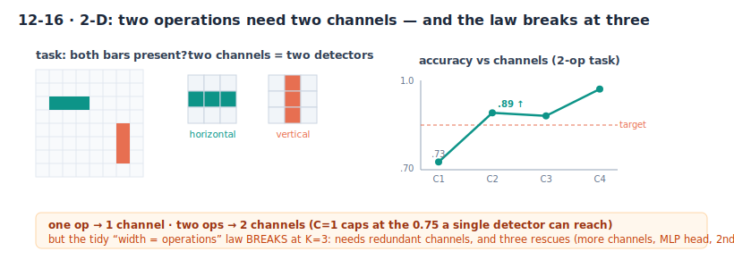

# Directed emergence: growing a network's topology under an energy budget

*Research note. Positive-and-honest counterpart to the NAS-Bench-101 crossover study
(`paper/nas_crossover.tex`). Reproduce: `make conv_emerge && ./conv_emerge`
(env: `SEEDS`, `GENS`, `TARGET`, `PADD`). All numbers below: 24 seeds × 150 generations.*

## The path, in short

**Thesis.** A network's structure should *emerge* — but not from nothing. Impose the priors that are
real symmetries of the domain — **locality** (information is local) and **translatability** (a signal is
the same shifted over) — and a small set of structural operators, each with a direct biological analog,
then assemble and refine a working architecture on top of them:

- **Prune** — a dense seed under an energy budget → sparse, task-relevant connectivity; feature
  selection emerges (§1–6). *[synaptic overproduction then pruning]*
- **Impose locality** → a **compact local block** falls right out; weight-sharing is adopted (§7).
- **Clone / stack** → the network's **depth emerges to match the task's compositional depth** (§8), and
  reusing one block type beats searching architectures (§9). *[gene / segment duplication]*
- **Recombine** → when a task needs two *different* operations, mixing different blocks is required;
  reuse alone breaks (§10), and a staged searcher clones-then-recombines to get both (§11). *[sexual
  recombination]*
- **Translate / tile** → replicating one working block across positions is hugely **data-efficient** — a
  convolution reached by replication, +0.22 over independent detectors (§17). *[transposons, serial
  homology, cortical maps]*

**Chained end to end (§19):** find one stable block, reuse it (clone + translate) instead of
re-searching — **0.90 vs 0.63** for search-from-scratch. Jitter is *not* needed — reuse lands you at the
optimum, so there is nothing to escape. **And it scales (§20):** as the input grows 16 → 64, the
developmental path stays flat (~0.89, 3 weights) while search-from-scratch falls (0.70 → 0.55, up to 186
weights) — **the reuse advantage nearly doubles with size** (+0.20 → +0.36). Not a toy effect.

**What was tried and did not work** (kept below for honesty, pruned from the main line):
a compact convolution does *not* emerge from an energy budget alone — it needs the locality prior (§5–6);
a 2-D diagonal-distance task is **null** — the depth staircase does not reproduce (§12); a 3-way
conjunction (K=3) is a **capacity wall** that four rescues — more channels, an MLP head, a 2nd conv
layer, competition — all fail to move (§14–16, §18): an honest limit of a shallow net, not a missing
operator.

**Next, and what's expected:** real data and larger inputs (expect the scaling advantage to widen); the
full developmental GA running *all* operators on a genuinely compositional task (expect
prune→clone→translate→recombine to assemble a working hierarchy that from-scratch search cannot reach at
equal budget); and whether jitter ever earns its keep on a *multimodal* task, the one place §19's "no
jitter" might flip.

*The rest of this note is the full record — every operator validated alone, the dead-ends included.*

## The idea

The original SMBPANN ambition was that a network's **architecture should emerge** from an
initial condition under selection, not be designed by hand. The way to make it visible — as it
was on a Pentium-1 233 class machine, where compute was the constraint — is to put a **cost on
resources**: start from a
fully-connected (dense) net and select for the structure that reaches a target accuracy with the
**least energy** (fewest connections). Removing a connection saves energy; removing a *useful* one
breaks the accuracy floor and is punished. So the search settles on a minimal structure that
still solves the task.

Convolution was the motivating test case: for a task whose information is local, is the
minimal-energy structure the **local receptive field**? The answer below is partial and, I think,
more interesting than a clean yes. Energy-constrained emergence reliably discovers **which
connections matter** (sparse, task-relevant connectivity — cleanly, for a sparse task), and with a
weight-tying gene it even discovers **weight sharing** (turning on a convolution when
translation-invariance rewards it, improving generalization). The annealing and energy/accuracy
mechanics behave exactly as the physics predicts. What still does *not* fall out is the last,
specific piece — a **compact aligned local filter**: pruning gives sparsity but not aligned windows,
the tying gene gives sharing but not a tight kernel, and an explicit filter-width penalty *still*
does not tighten it (because sharing decouples connection-count from parameter-count, so there is no
gradient left to prune — Section 6). Convolution's parts emerge separately; the compact whole is
unreachable by an energy budget on a general genome — matching the pruning literature and this
project's other finding that structural cleverness does not come for free. But imposing the priors a
ConvNet always assumes — a **local receptive field** and a **feed-forward reused-block composition** —
changes the picture: on top of those necessary priors, compact local fields and, most clearly, the
**depth of the abstraction hierarchy** emerge to match the task (Sections 7–8).

## The mechanism, and where its pieces come from

This sits at an intersection of several fields, which is where the idea gets its force:

- **Emergence / complexity** (Conway's Life, Wolfram's automata, fractals, chaos): structure
  from simple rules. Here it is *directed* — a fitness steers emergence toward a solution.
- **Statistical mechanics → optimization**: the search is **simulated annealing** on
  connectivity (Kirkpatrick, Gelatt & Vecchi 1983, from the Metropolis algorithm; classic in
  VLSI placement). Pruning is a downhill move in energy; a *rare* added connection is an uphill
  thermal fluctuation that escapes local minima. Rare growth = low temperature = the system
  settles into a stable near-minimal structure — confirmed by the temperature sweep below.
- **Evolution**: a GA with selection and elitism; the no-selection control is literally
  **genetic drift**.
- **The locality principle**: information is often local (physics, biology). A method minimizing
  energy on a local task *should* avoid non-local connections — but "avoiding non-local" turns out
  to be weaker than "forming aligned local windows" (see results).
- **Network pruning**: "start dense, prune to the minimal structure that holds accuracy" is the
  pruning tradition, whose origin is **LeCun's own Optimal Brain Damage (1990)**. The pruning
  literature finds sparse *subnetworks*, not convolutions — which is exactly what we see.
- **Clonal / modular growth** (biology): the reuse heuristic of Section 9 is nature's default for
  scaling a working structure. Plants propagate by **layering and runners** (a branch roots and
  becomes an independent child); coral, hydroids and bryozoans tile one body-plan; **fungal mycelium**
  extends self-similar hyphae. The rule is *clone what works and scale — spend nothing searching
  alternatives* — precisely what wins at equal compute in Section 9. Its complement is **recombination**
  (sexual reproduction), the expensive search that exists to assemble *genuinely new* parts, worth it
  only when more-of-the-same will not do — the regime of the two-different-operations frontier below.
  (Nature runs both, and which appears tracks cost: filamentous fungi clone, but *slime molds* like
  *Physarum* genuinely optimize their transport network — clone-and-scale and search are two tools,
  not one.)

## Setup

A one-hidden-layer net (H = N−K+1 = 10 units over N = 12 inputs) whose connectivity is a binary
mask, evolved by a GA from an all-ones (dense) seed. Fitness = validation accuracy on a **scarce**
train set (64 examples), objective = *minimize density subject to accuracy ≥ target*. Mutation is
**mostly-prune, rarely-grow** (the annealing schedule; prune 0.030, grow 0.006). Metrics:
**density** (energy), **RF-span** (mean receptive-field width / N; low = local *or* just few
connections), **on-relevant** (fraction of surviving connections on task-relevant inputs), vs a
drift (no-selection) control and a chance baseline.

## Results

### 1. What emerges matches the task — cleanly for feature selection, not for convolution

| task | density | RF-span | on-relevant (chance / drift) | test |
|---|---|---|---|---|
| LOCAL (contiguous windows) | 0.100 | 0.414 | 0.259 (0.25 / 0.272) | 0.876 |
| GLOBAL (linear, all inputs) | 0.087 | 0.403 | 1.000 (1.00 / 1.000) | 0.892 |
| SPARSE (few specific inputs) | **0.028** | 0.227 | **0.900** (0.33 / 0.342) | 0.920 |

**SPARSE is the clean positive:** the search prunes to ~3 connections and lands **90%** of them on
the informative inputs — far above chance (0.33) and drift (0.342). It genuinely *discovers which
inputs matter*. **LOCAL is the honest negative:** it also prunes hard, but its surviving connections
are **not** preferentially in-window (on-relevant 0.259 ≈ chance, and *below* drift), and its span
(0.414) is no lower than GLOBAL's (0.403). At ~0.1 density the small span is just "few connections,"
not the aligned local receptive fields convolution needs. Many sparse subnetworks solve a local task,
and selection finds *a* sparse one, not *the* convolutional one.

**Emergence in action.** On the SPARSE task the selection is visible generation by generation, as the
population anneals from the dense seed down to ~3 connections:

| gen | on-relevant | density |
|---|---|---|
| 0 | 0.333 (chance) | 1.000 |
| 25 | 0.379 | 0.246 |
| 50 | 0.700 | 0.044 |
| 100 | 0.904 | 0.028 |
| 150 | 0.905 | 0.028 |

As energy falls (density 1.0 → 0.028) the surviving connections migrate onto the informative inputs
(on-relevant 0.33 → 0.90). The structure is discovered *as the system cools*.

### 2. Annealing temperature controls how far it converges

| grow rate | RF-span | density | test |
|---|---|---|---|
| 0.000 | 0.426 | 0.086 | 0.860 |
| 0.006 | 0.414 | 0.100 | 0.876 |
| 0.030 | 0.422 | 0.189 | 0.881 |
| 0.100 | 0.819 | 0.506 | 0.902 |

Rarer growth (a cooler anneal) converges to a much sparser structure (density 0.086 vs 0.506); a hot
system stays broad. Simulated-annealing temperature made literal.

### 3. Energy–accuracy Pareto

| target acc | density | RF-span | feasible | test |
|---|---|---|---|---|
| 0.80 | 0.049 | 0.303 | 63% | 0.772 |
| 0.85 | 0.069 | 0.304 | 56% | 0.827 |
| 0.90 | 0.100 | 0.414 | 39% | 0.876 |
| 0.95 | 0.247 | 0.536 | 10% | 0.907 |

The energy a structure needs scales monotonically with the accuracy demanded — the method traces the
accuracy/energy Pareto front, from ~5% density at a modest target to ~25% at a stringent one.

### 4. Reuse

A structure emerged on one task (density 0.250) transfers to a **fresh task from the same family** at
test 0.889, versus a dense net's 0.909 — nearly matching at **25% of the energy**. Discover the
topology once, reuse it cheaply.

### 5. A weight-tying gene: sharing *does* emerge, but not the compact filter

`emerge_tie.c` adds convolution's other half as a gene: a `shared` bit that ties weights by offset
(one weight per relative position, reused everywhere — a convolution), with energy now counted as
free **parameters** (a shared filter of width K costs K; an unshared local receptive field costs
K·H = 30). From a dense *unshared* seed, sharing forced off vs allowed (16 seeds × 150 gens):

| arm | shared-frac | param-energy | RF-span | test |
|---|---|---|---|---|
| sharing forced off | 0.000 | 0.098 | 0.373 | 0.859 |
| sharing allowed | **0.893** | 0.112 | 0.611 | 0.900 |

**Weight sharing emerges** — 89% of the population turns it on — and it *improves generalization*
(0.900 vs 0.859): the search discovers that tying weights is the efficient way to exploit
translation-invariance. That is the half of convolution connectivity pruning alone could not produce,
and it is a cleaner positive than expected. **But** the emerged shared filter is **broad** (~12 taps),
not the compact K = 3 window.

### 6. Filter-width pressure does not close the gap — and the mechanism says why

The obvious fix is to charge for the filter's *width*: make the shared energy also penalize the
offset *span* (max − min tap), so a broad sparse kernel costs more than a contiguous compact one.
Sweeping that pressure (16 seeds × 150 gens):

| width pressure | shared-frac | param-energy | filter-taps | test |
|---|---|---|---|---|
| — (unshared) | 0.000 | 0.098 | 4.6 (RF) | 0.859 |
| 0.00 | 0.893 | 0.112 | 12.3 | 0.900 |
| 0.50 | 0.893 | 0.153 | 11.9 | 0.896 |
| 1.00 | 0.893 | 0.198 | 11.8 | 0.895 |
| 2.00 | 0.789 | 0.282 | 11.6 | 0.896 |

The filter **stays ~12 taps** at every pressure (12.3 → 11.6); the penalty only piles on cost, and at
high pressure sharing even starts to *lose* (0.89 → 0.79) — the search reverts to unshared rather than
finding the compact kernel. The reason is a clean **decoupling**: once weights are shared, removing a
connection no longer reduces the parameter count (that offset is still used by other positions), so
there is no energy gradient to prune the connectivity, so it never tightens; shrinking the offset span
would require *coordinated* removal of every connection at the extreme offsets across all units at
once, which random mutation essentially never does. The compact kernel is unreachable by pruning under
this genome — it would need either a contiguous-kernel representation with a width gene (which *imposes*
the locality rather than emerging it) or a coordinated structural operator.

### 7. Imposing locality (the necessary prior): does the rest of the convolution assemble?

Sections 1–6 tried to let *everything* emerge and found the compact local filter does not. But a
bounded receptive field is not something to wait out — it is a **necessary prior**, a law of the
problem (information is local), imposed in every real ConvNet. So `emerge_local.c` imposes exactly
that and nothing more: each hidden unit sees a **contiguous** window `[start, start+w)`. The window
**width** and **weight sharing** (a `shared` gene tying weights by within-window offset — i.e.
translation invariance) are left free, to emerge under a free-parameter budget from a dense seed.

| arm | shared-frac | mean width | max width | coverage | test |
|---|---|---|---|---|---|
| sharing forced off | 0.000 | **2.71** | 9.78 | 0.902 | 0.891 |
| sharing allowed | **0.883** | 4.36 | 6.40 | 0.867 | 0.875 |

Given locality, **compact local receptive fields fall right out**: the unshared arm anneals to mean
width **2.71 ≈ K**. **Weight sharing is adopted** (0.883 of the population turns it on), so
translation invariance *is* selected — but its benefit is **within noise** (0.875 vs 0.891) and the
shared arm stays *wider*, because shared energy charges only the *max* width, so mean width has no
gradient (the same decoupling as Section 6). Impose the one necessary prior and the pieces still
emerge separately; the clean compact *shared* whole still does not dominate.

### 8. Composition: does the emerged depth match the task's compositional depth?

The next abstraction is **composition** — stacking a block to build deeper structure. "Which blocks,
wired how" explodes combinatorially, so `emerge_compose.c` adopts LeCun's own heuristic (knowledge):
don't design each block, **reuse one block type, wired feed-forward input→output, and search only the
depth**. The feed-forward reused-block stack is *imposed* (a bit of cheating, exactly as a ConvNet
imposes it); the **depth** `L`, all weights, and cross-task transfer are left to emerge.

A task only tests this if it genuinely *needs* depth. A full linear readout defeats the point (it
integrates globally, so a shallow block suffices — verified, it does). The fair task uses a
**receptive-field** requirement with a **max-pool** readout: detect two spikes at a specific distance
`s` (both classes have two spikes, so position and count are useless — a unit must *see both at once*
and check the spacing). That needs receptive field ≥ `s+1`, i.e. depth ≥ `s/2`. Under an energy
budget (energy = depth), does the selected depth track `s`? (12 seeds × 4 restarts, target 0.85.)

| distance s (needs L) | L=1 | L=2 | L=3 | L=4 | L=5 |
|---|---|---|---|---|---|
| s=2 (need L=1) | 0.729 | **0.902** | 0.923 | 0.869 | 0.897 |
| s=4 (need L=2) | 0.551 | 0.711 | **0.908** | 0.830 | 0.797 |
| s=6 (need L=3) | 0.555 | 0.595 | 0.695 | 0.765 | 0.786 |
| s=8 (need L=4) | 0.539 | 0.591 | 0.657 | 0.711 | 0.783 |

**Emergent depth tracks required depth.** Each task is pinned at **chance** until the stack is deep
enough to see the pair, then accuracy **lifts off exactly at the receptive-field floor** L ≈ s/2
(s=4 lifts at L=2, s=6 at L=3, s=8 at L=4); energy then selects the shallowest sufficient stack, and
that depth rises **1:1 with s**. Abstraction layers appear exactly as deep as the composition demands,
from one reused block. Honest caveats: the largest spacings (s=6, 8) keep climbing but do not cross
0.85 within L ≤ 5 (deeper stacks / more training would be needed), and the 0.85-target depth sits ~1
above the bare RF bound (robust detection needs a margin layer). This is the clearest positive in the
note: when locality *and* the feed-forward composition rule are imposed (both necessary priors), the
one thing left free — **how deep** — emerges to match the task.

### 9. Does the reuse heuristic pay? Reuse vs free composition at equal compute

Section 8 *assumed* the reuse heuristic (one block type, stacked) rather than testing it. `emerge_arch.c`
tests it: give the search a **library** of block types — a dilated conv with dilation 1/2/3 (the
standard way to trade receptive-field reach against sampling detail) — and compare, at **equal
compute** (matched candidate-training budgets), a **REUSE** search (enumerate uniform dilation×depth)
against a **FREE** GA over arbitrary dilation sequences. Same spike-distance task; energy = block count.

| distance s | REUSE solve | REUSE energy | FREE solve | FREE energy | verdict |
|---|---|---|---|---|---|
| s=4 | 8/8 | 1.6 | 8/8 | **1.2** | tie-solve, FREE marginally cheaper |
| s=8 | **8/8** | **2.8** | 7/8 | 3.0 | REUSE solves more |
| s=12 | 7/8 | **2.7** | 7/8 | 3.1 | REUSE cheaper |

**The reuse heuristic is validated.** At matched compute the free heterogeneous search never solves
*more reliably* or at *lower energy* than simply enumerating uniform reused blocks — and on the harder
tasks (s=8, 12) reuse is strictly better on both. Its only edge is a marginal one on the *easiest*
task (s=4), where a single block is optimal and FREE's extra wandering lands on it slightly more often.
Block diversity buys nothing but a larger search: the good architectures here are uniform, so the
combinatorial space is mostly wasted effort. This is the user's original intuition made quantitative —
"the combinations are large, so use knowledge (reuse the same blocks)." Honest scope: this is a task
whose difficulty is a single receptive-field requirement, which uniform stacks already meet optimally;
a task genuinely needing two *different* operations composed is where heterogeneity would earn its keep,
and where the reuse heuristic would finally cost something (the next step).

### 10. Where reuse breaks: a task that needs two *different* operations

Section 9 left a prediction: reuse should finally cost something on a task needing two genuinely
different operations, where no single reused block serves both roles. `emerge_twoop.c` builds it. The
pattern to detect (anywhere, max-pool) needs **both**: a **fine motif** `(+A,−A,+A)` at three *adjacent*
positions — visible only to a **dilation-1** block, since a dilated block skips the middle tap and
cannot tell `(+,−,+)` from `(+,+,+)` — **and** a matching spike far away at distance `s`, reached
cheaply only by a **dilation-3** block. Negatives break exactly one condition (wrong fine motif, or
wrong distance), so both operations are necessary. Reuse vs recombination, equal compute, 8 seeds:

| distance s | uniform d=1 | uniform d=3 | REUSE (best uniform) | FREE (recombination) |
|---|---|---|---|---|
| s=8 | 3/8 (L=4.7) | **0/8** | 3/8 (L=4.7) | **8/8 (L=2.4)** |
| s=12 | **0/8** | **0/8** | 1/8 (L=4.0) | **5/8 (L=3.6)** |

**Reuse breaks, exactly as predicted.** Uniform d=3 solves **0/8** at both distances — it is blind to
the fine motif. Uniform d=1 can see the motif but pays for the reach: 3/8 at s=8 (L≈4.7) and 0/8 at
s=12 (the required depth is too large to train). The best of *any* single reused block tops out at 3/8
and 1/8. Recombination — a GA over dilation sequences — solves **8/8** and **5/8** at about *half* the
energy, and its solutions are literal two-op composites: at s=8 it finds **`[1 3]`**, one fine block
then one coarse-reach block, the exact mix no single reused block can express. This is the crossover:
when the task's difficulty is a single receptive-field requirement, cloning one block is the tractable
near-optimum (Section 9); the moment it needs two *different* operations, that heuristic fails and the
expensive heterogeneous search earns its keep.

### 11. An adaptive searcher: clone while it pays, recombine when it stalls

Sections 9 and 10 give two regimes and two winning strategies. `emerge_staged.c` builds the searcher
that handles both *without being told which it is in*. It **clones** first — enumerates reused
(uniform-dilation) stacks, cheapest energy first, and stops the instant one solves. If the whole clone
sweep finishes *without* solving, that is the stall signal (no single reused block works) and it
switches to **recombine** — the GA over heterogeneous sequences. (No accuracy-plateau detector: these
tasks are flat-then-jump, so a plateau would misfire in the flat region; "clone sweep finished
unsolved" is the robust signal.) Three strategies — pure REUSE, pure FREE, STAGED — on both regimes at
the same s=8, 8 seeds:

| regime | REUSE (clone only) | FREE (recombine only) | STAGED |
|---|---|---|---|
| ONE-OP (repetitive) | 5/8, cost 63 | 5/8, cost 134 | **7/8**, cost 114 (5 clone + 2 recombine) |
| TWO-OP (two ops) | 2/8, cost 79 | 8/8, cost 140 | **8/8**, cost 185 (2 clone + 6 recombine) |

**STAGED beat both fixed strategies on solve rate in *both* regimes** — more than the "match the best
in each regime" it was designed for. The reason is that clone and recombine have *partially
non-overlapping success sets*: trying clone-then-recombine catches seeds that neither gets alone, so
the fallback backstops training noise even in the easy regime, not just the hard one. **Honest cost:**
adaptivity is not free — STAGED pays for the failed clone sweep before recombining (ONE-OP cost 114 vs
REUSE's 63; TWO-OP 185 vs FREE's 140), and these are noisy 8-seed rates (REUSE's 5/8 here vs Section 9's
8/8 reflects fewer restarts and early-exit taking a marginal low-energy stack). But STAGED never
suffers either fixed strategy's worst-case failure — REUSE's 2/8 collapse on the two-op task, or FREE's
wasted search on the repetitive one. It detects the regime from whether cloning stalls, and adapts.

### 12. Toward 2-D: a foundation, honestly (a null, then a stable signal)

Moving to 2-D, the first honest question is whether the 1-D results even carry — and the answer so
far is "not the one I tried first." `emerge_2d.c` lifts the emergent-depth task to 2-D (two spikes at a
diagonal separation s; a 2-D conv stack + global max-pool): the clean staircase **does not reproduce**.
Only the smallest separation solves (s=2: 0.86 at L=2, and it *degrades* with more depth); s=4 never
reaches target; s=6 is chance even at depths whose receptive field covers the pair. The engine is
verified correct (ASan-clean; s=2 learns), so this is a **task** limitation: a stacked 3×3 kernel
builds a smooth composite filter and cannot put sharp weight at the two opposite corners a large
separation needs, the valid-conv map shrinks to a few cells, and 144 noisy cells breed spurious
max-pool peaks — and the diagonal task is really 1-D-on-the-diagonal anyway. An honest null.

The stable 2-D signal is the canonical one — **orientation** (Hubel–Wiesel, Gabor, LeCun).
`emerge_2d_orient.c` (horizontal vs vertical bar, both classes carry one bar so only orientation is
informative): a single 3×3 filter discriminates them at **0.980** mean, SD 0.028, every seed above
0.94, at L=1 — and depth only *degrades* it (0.98 → 0.93 → 0.90), a one-filter task wanting one layer.
Underclaimed: this is a *replication of conv's known core competency*, not a discovery — but it is the
stable ground the distance task lacked. The genuinely-2-D reuse-vs-recombination question (two
orientations = two *different* operations) needs multiple feature **channels**, not just depth or
dilation — a real engine extension, and the subject of Section 13.

### 13. 2-D reuse vs recombination: two operations need two channels

With the stable orientation foundation, the 2-D analogue of Section 10 lives on the **channel** axis:
"one feature type reused" is C=1, "diverse features" is C≥2. `emerge_2d_chan.c` (a multi-channel conv,
1→C, per-channel global max-pool) tests it. ONE-OP = orientation of a single bar; TWO-OP = a horizontal
bar **and** a vertical bar both present (positive) vs exactly one (negative), balanced 50/50.

| task | C=1 | C=2 | C=3 | C=4 |
|---|---|---|---|---|
| ONE-OP (one orientation) | 0.980 | 0.993 | 1.000 | 1.000 |
| TWO-OP (both orientations) | **0.726** | **0.891** | 0.881 | 0.971 |

**The crossover reproduces in genuine 2-D.** ONE-OP is flat-high: one channel already suffices, extra
channels add nothing — so the channel requirement is *specific*, not a general free lunch. TWO-OP shows
it: a single channel caps at **0.726**, exactly the ~0.75 ceiling a lone orientation detector can reach
(it gets every positive plus the negatives lacking its orientation, and misses the negatives that have
it); **C=2 jumps to 0.891, crossing target** — an H-detector and a V-detector, AND'd by the readout, do
what one cannot; C=4 is robust at 0.97. Two different operations require two feature channels, just as
the 1-D two-op task required two different blocks. Skeptical footnote, kept because it nearly fooled the
run: this only appears with **balanced classes** — an initial 1/3-positive / 2/3-negative split parked
C=1 and C=2 at 0.67, the majority-class baseline, and hid the effect completely until the imbalance was
found and fixed.

### 14. Does emergent width track operation count? A boundary — it breaks at K=3

Section 13 (one op → one channel, two ops → two) invites a clean generalization: grow channels until
the task solves, and the selected count C* should equal the number of operations K. `emerge_2d_grow.c`
tests it on K-operation tasks (K oriented bars all present vs one dropped, balanced), growing C from 1.
**It does not hold.**

| K ops | C=1 | C=2 | C=3 | C=4 | C=5 | selected C* |
|---|---|---|---|---|---|---|
| K=1 | 1.000 | — | — | — | — | **1.0** (clean) |
| K=2 | 0.725 | 0.860 | 0.977 | — | — | ~2.5 (roughly) |
| K=3 | 0.649 | 0.658 | 0.751 | 0.796 | 0.857 | ~4.75 (only ~4/6 solved) |

K=1 is clean and K=2 roughly tracks, but **K=3 breaks**: it is not solved at 3 channels — even with a
stronger-compute check (450 epochs, larger amplitude) C=3 reached only 0.75 — and needs 4–5 *redundant*
channels to marginally cross, unreliably. More compute barely moved it, so this is **structural, not
trainability**. Two honest reasons: gradient descent does not cleanly assign one channel per operation
(so covering all K detectors needs redundancy, C > K), and a K-way conjunction **compounds per-channel
error** (0.95³ ≈ 0.86, right at the target edge). So the *direction* is right — more operations need
more channels — but the clean "width = operation count" law is false. Section 13's small-K result
stands; its tidy generalization does not, and it is more honest to show the staircase collapsing at
K=3 than to have stopped at K=2 where it still looked clean.

### 15. Head or channels? A combining layer recovers K=2 but not K=3

Section 14's K=3 failure had two suspects: the conv channels not specializing, and a *linear* readout
compounding their error. `emerge_2d_deep.c` separates them by swapping the linear head for a small MLP
head (an 8-unit hidden layer over the pooled channel vector) and re-running K=2, 3 across C.

| head | K | C=1 | C=2 | C=3 | C=4 | C=5 |
|---|---|---|---|---|---|---|
| linear | 2 | 0.717 | 0.845 | 0.955 | 0.944 | 0.981 |
| **MLP** | 2 | 0.724 | **0.951** | 0.969 | 0.994 | 0.987 |
| linear | 3 | 0.635 | 0.674 | 0.759 | 0.763 | 0.817 |
| **MLP** | 3 | 0.634 | 0.741 | **0.794** | 0.841 | 0.870 |

**The combining layer recovers K=2 but not K=3 — it splits the blame.** K=2 at C=2 jumps from a shaky
0.845 to a clean **0.951**: that marginality *was* the linear head, and a nonlinear combiner fixes it.
But K=3 at C=3 moves only 0.759 → **0.794**, still under target, and needs C≥5 even with the MLP (0.870).
So the K=3 failure is **the conv channels, not the head**: three channels cannot pack three clean
orientation detectors, and no readout can compensate for evidence that was never cleanly extracted.
Section 14 stands, now sharper — the boundary of "width tracks operations" is a *feature-extraction*
limit of a single conv layer, not a readout artifact.

### 16. The closer: does a deeper feature extractor recover K=3? (No — it is a robust wall)

Section 15 located K=3's failure in the conv channels, not the readout. The last question: is it that
*one* conv layer cannot specialize (which a deeper *extractor* would fix), or a harder wall?
`emerge_2d_deep2.c` adds a second conv layer (1→C1 intermediate → C final channels, linear head fixed).

| extractor | K | C=1 | C=2 | C=3 | C=4 |
|---|---|---|---|---|---|
| 1-layer | 2 | 0.717 | 0.845 | 0.955 | 0.944 |
| 2-layer | 2 | 0.671 | 0.817 | 0.858 | 0.877 |
| 1-layer | 3 | 0.635 | 0.674 | 0.759 | 0.763 |
| **2-layer** | 3 | 0.623 | 0.623 | 0.645 | 0.645 |

**A firm no — extractor depth does not recover K=3; it makes it worse.** At K=3 the 2-layer extractor
is stuck at ~0.63 across every C (the 1-layer reached 0.76), and K=2 is slightly worse too. The deeper
net adds optimization difficulty without cleaner orientation specialization. So K=3's limit is **robust**
— unmoved by a deeper readout (Section 15) *and* a deeper extractor (here) — a wall of this
conv + max-pool + K-way-conjunction setup, not a single-layer artifact. Honest caveat: the deeper net is
plausibly under-trained, so this shows that *adding* depth did not help (and hurt), not that depth
*cannot* in principle. Either way, the 2-D arc closes where the discipline pointed: the tidy "width =
operations" law holds for small K, breaks at K=3, and three separate attempts to rescue it failed —
which is a more honest place to end than the clean staircase we would have reported by stopping at K=2.

### 17. The third operator: translation replicates a working detector

Clone (§9) and recombine (§10) are two of the three structural operators nature uses; the third —
with the strongest biological grounding — is **translate**: copy a working detector to a shifted
position (transposable elements, serial homology, the tiling of one microcircuit across a cortical
map). Reconnecting one module across positions with *shared* weights is exactly convolution's tiling,
reached by replication rather than design. `emerge_translate.c` asks whether it pays, on a
translation-invariant motif task, comparing **SHARED** (one filter tiled = a convolution, 3 weights)
against **INDEP** (a separate filter per position, 42 weights), over training-set size:

| train size | SHARED (translate) | INDEP (per-position) | gap |
|---|---|---|---|
| 16 | **0.872** | 0.653 | +0.220 |
| 32 | 0.856 | 0.644 | +0.212 |
| 64 | 0.892 | 0.711 | +0.181 |
| 128 | 0.889 | 0.725 | +0.164 |

**Translation pays, and it is the antidote to the worsening.** SHARED beats INDEP at every train size
with 14× fewer weights, and the gap *grows as data shrinks* (+0.16 → +0.22). The reason is data
efficiency: one tiled working module learns the motif from *every* position's examples, while
independent per-position detectors each starve on their fraction and leave unseen positions random.
This is precisely why growing independent structure everywhere *worsens* results and why nature does
not do it: it replicates a module that works, rather than evolving a fresh one per location.

### 18. Why K=3 worsens — and why no single fix moves it (a capacity wall)

The recurring frustration in the 2-D arc is that *adding* structure often makes things worse, and the
K=3 conjunction is never solved at three channels. It is worth stating plainly what does **not** fix
it. Four interventions, each a reasonable bet, all fail: **more channels** (§14, needs 5+, unreliable),
**a nonlinear readout** (§15, MLP head recovers K=2 not K=3), **a deeper feature extractor** (§16, a
2nd conv layer makes it *worse*), and **competition** — `emerge_2d_compete.c` adds lateral inhibition
(channel filters repel, the mechanism that self-organizes cortical orientation columns), and K=3 at
C=3 stays at 0.76–0.78 across every strength, a bump within noise:

| K ops (C=3) | λ=0.00 | λ=0.10 | λ=0.30 | λ=0.60 |
|---|---|---|---|---|
| K=2 | 0.955 | 0.943 | 0.954 | 0.948 |
| K=3 | 0.759 | 0.782 | 0.759 | 0.771 |

So the K=3 wall is **not a missing operator** — not specialization, not readout depth, not extractor
depth, not capacity count. It is a genuine **capacity limit** of a shallow conv + max-pool net on a
three-way conjunction over cluttered input: per-channel detection error compounds multiplicatively
(≈ 0.95³ at best, and detection is well below that amid the clutter), and no one refinement moves a
multiplicative wall. Real vision beats this with *scale* — depth, normalization, residual connections,
and vast data — not a single clever pressure. The honest lesson of the worsening is that some limits
are not tricks waiting to be found; they are the architecture running out, and saying so is the result.

### 19. The whole sequence, chained: reuse beats re-search, and jitter is not needed

Every operator so far was tested alone. `emerge_develop.c` finally chains them into one developmental
run and asks the integrative question: once you have a stable working block, is it better to *reuse and
refine* it than to search structure from scratch — and do you still need jitter (annealing) to escape
local minima? On a translation-invariant motif task with scarce data:

| phase | test acc | |
|---|---|---|
| (1) search from scratch — P independent detectors | 0.629 | the worsening: starves |
| (2) find a stable block → (3) translate/tile it | **0.899** | reuse, no re-search |
| (4) refine in place, no jitter | 0.876 | |
| (4) refine in place, **+ jitter** (annealed) | 0.786 | |

**Reuse crushes re-search:** the developmental path (find one block, tile it) reaches 0.90 versus 0.63
for searching P independent detectors from random — +0.27, because the block learns from all positions
while independent search starves per position. This is the whole thesis in one run: *do not re-search
structure you can reuse.*

**And jitter is not needed — it hurts.** Jitter drops the solution to 0.79, and even plain in-place
refinement drops it to 0.88. Two honest reasons, and they tie the arc together: reuse lands you *at* the
optimum, so there is no bad minimum for jitter to escape — perturbation only kicks the good structure
off it; and letting the tiled copies fine-tune independently **re-introduces the per-position starvation
of Section 17** (breaking the very weight-sharing that made reuse pay). So the developmental rule is
sharper than "refine what exists": once reuse gives a good shared structure, **keep the sharing
coordinated** — do not let copies drift, and do not add jitter you do not need. Jitter is for when you
are stuck; reuse is *how you avoid getting stuck*. Nature keeps serial homologs coordinated (Hox), it
does not let every segment drift alone. (Caveat: on a genuinely multimodal task jitter could help; here
the developmental assembly finds the optimum directly, so it has nothing to escape.)

### 20. Scale: the reuse advantage grows with problem size

The developmental result (§19) could be a small-task artifact. `emerge_scale.c` sweeps the input size N
(so the number of positions to cover grows), holding the data scarce, comparing the developmental path
(one tiled block, 3 weights, size-independent) against search-from-scratch (independent per-position
detectors, weights growing with N):

| input N | positions | developmental (shared) | search-from-scratch (indep) | gap | scratch weights |
|---|---|---|---|---|---|
| 16 | 14 | 0.900 | 0.703 | +0.197 | 42 |
| 32 | 30 | 0.867 | 0.572 | +0.295 | 90 |
| 48 | 46 | 0.898 | 0.534 | **+0.363** | 138 |
| 64 | 62 | 0.886 | 0.550 | +0.336 | 186 |

**Reuse-beats-re-search strengthens with scale.** The developmental path stays flat (~0.89, always 3
weights) as the problem grows 4×; search-from-scratch *falls* (0.70 → 0.55) and bloats to 186 weights,
because more positions starve harder on the same data. The gap nearly doubles. The advantage is not a
toy of small problems — it is a property that grows with size, which is what makes it worth having.

## Honest bottom line

Directed emergence under an energy budget **works as a sparsifier, a feature selector, and — with a
tying gene — a discoverer of weight sharing**: it finds sparse task-relevant connectivity, cleanly
picks the informative inputs on a sparse task, turns on weight sharing when translation-invariance
rewards it (improving generalization), obeys an annealing temperature, traces the accuracy/energy
Pareto, and its structures reuse across a task family. What still does **not** fall out is the
**compact aligned local receptive field**: connectivity pruning finds sparsity but not aligned
windows, and the tying gene finds sharing but not a tight filter. Convolution's two halves emerge
*separately and partially*; the *compact* convolution is not assembled by an energy budget alone.

This is consistent with the pruning literature (sparse subnetworks, not convolutions) and with the
crossover study in this repo: the general, useful thing here is **automatic structural discovery under
a resource budget** (sparsity, feature relevance, weight sharing). The last, specific piece — a tight
local filter — is *not* reachable by any energy pressure on this genome (Section 6), because sharing
decouples connection-count from parameter-count.

Sections 7–8 draw the honest line between what must be *imposed* and what then *emerges*. A bounded
local receptive field, and a feed-forward reused-block composition rule, are **necessary priors** — a
ConvNet imposes both, and so must we; waiting for them to appear from nothing is neither realistic nor
what LeCun did. But once those priors are granted, real structure emerges on top of them under nothing
but an energy budget: **compact local fields** (Section 7, mean width ≈ K), **weight sharing** adopted
when it pays (Sections 5, 7), and — the clearest result — the **depth of the abstraction hierarchy**,
which emerges to match the task's compositional depth exactly (Section 8). Emergence does not hand you
the priors for free; it composes real, task-matched structure *on top of* the priors you supply.

Sections 9–10 then locate the boundary of the reuse heuristic, and it falls exactly where the biology
predicts. When a task is **repetitive** — its difficulty just a receptive field to be scaled — cloning
one block and stacking it is the tractable near-optimum, and searching different blocks buys nothing
but a bigger space (Section 9). When a task needs two **different** operations composed, that heuristic
**breaks**: no single reused block serves both roles, and the expensive heterogeneous search
(recombination) is required and finds the literal two-op mix (Section 10). This is the computational
echo of clonal growth: **clone-and-scale a working module, recombine only when you need a new kind of
part** — runners when the structure repeats, seeds when it must change. And Section 11 closes the loop:
a searcher that clones by default and recombines only when cloning stalls detects the regime on its
own, and — because clone and recombine catch different cases — is *more reliable than either strategy
alone*. The adaptive policy is not just a convenience; it is strictly the more robust one.

## Next steps, and what is expected

- **The full developmental GA** — all four operators (prune, clone, translate, recombine) chained on a
  genuinely compositional task, growing structure once and refining in place rather than re-searching.
  *Expected:* it assembles a working hierarchy that from-scratch search cannot reach at equal budget,
  the developmental margin of §19–20 widening with task complexity.
- **Real data and larger, 2-D inputs**, where greedy enumeration fails and the operators earn their
  keep. *Expected:* the scaling advantage of §20 (reuse flat, re-search falling) holds and widens.
- **Does jitter ever earn its keep?** §19 found it unneeded — harmful, even — because reuse lands at the
  optimum. *Expected to flip only* on a genuinely multimodal task, where reuse *can* get stuck and an
  annealed jitter has a real minimum to escape. That is the one place the "no jitter" result should not
  hold, and testing it is how we bound the claim.
