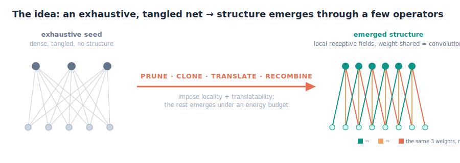
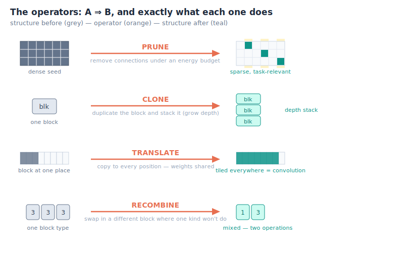
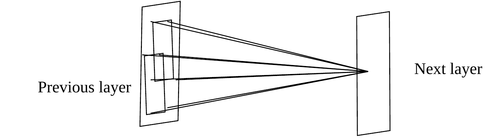
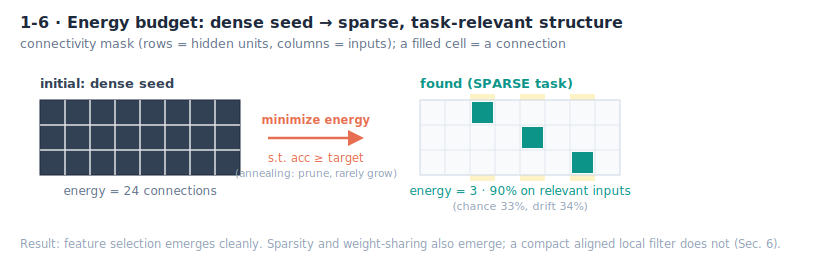
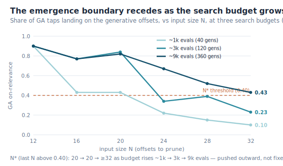
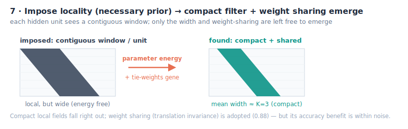
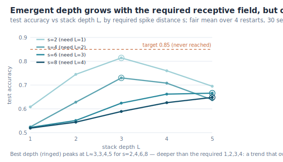
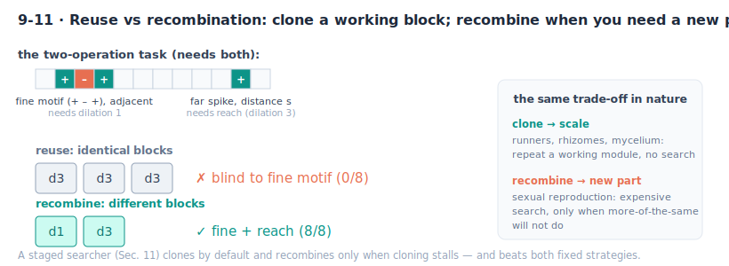
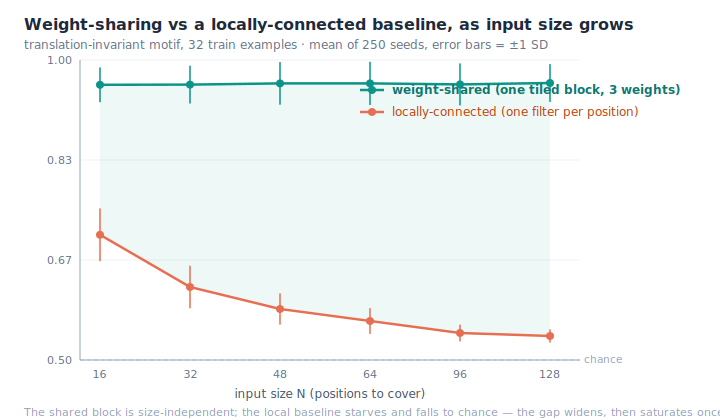

# Directed Emergence of Network Structure Under an Energy Budget

*Research note. Positive counterpart to this repo's NAS-Bench-101 crossover null (reconciled
in §6b; its code is in `validation/`). Reproduce: `make conv_emerge &&./conv_emerge`
(env: `SEEDS`, `GENS`, `TARGET`, `PADD`). §1 uses 24 seeds × 150 generations; later sections state their
own seed counts (e.g. 40 in §12–13, 50 in §6b, 250 in §14), each reproducible with the noted `SEEDS`.*

## Abstract

A network's structure should *emerge*, not be designed, but from what, and how much of it? This note
grows a network's topology from an **exhaustive (fully-connected) seed under an energy budget**, an
evolutionary search that pays for every connection, and asks *which pieces of convolution fall
out, and which do not*.

**What is genuinely new here** is that map. Starting *dense* and pruning under an *evolutionary energy
budget*, not the gradient pruning of Optimal Brain Damage / Lottery Ticket, nor the grow-from-minimal of
NEAT, we characterize what emerges: sparse task-relevant connectivity emerges cleanly; weight-sharing is
*adopted* when translation-invariance rewards it; and a **compact aligned local filter** emerges too,
but only once mutation acts on the shared feature the way real genetics does (a global change to a
shared weight, not a per-connection edit), which restores the energy gradient a per-connection pruner
lacks (§6). A second finding (§6b): under this budget a directed search finds a *tidier* filter than
random sampling and is *modestly more accurate* too (a large structural win plus a small but significant task edge, surviving a denoising control), which
reconciles this repo's earlier crossover null, directed search beats random when the objective can be
climbed and ties it when the landscape is flat. The contribution is that map itself: an evolutionary
energy-emergence from an exhaustive seed, *path-independent* (the same structure from a minimal seed grown
up, with SET/RigL a near neighbor), together with its boundary, negatives included.

**What we reproduce rather than claim as new.** On top of the priors a ConvNet also hardwires,
**locality** and **translatability**, the *real symmetries* of a signal, the free dimensions then emerge
to fit the task: compact local fields and the *depth* that matches a task's required receptive field. These confirm known
inductive-bias results, weight-sharing is data-efficient (LeCun 1989); receptive field ≈ depth, which we
verify with a **fair baseline** (weight-sharing beats even a *fully-trained, oracle-supervised*
locally-connected net; the advantage widens with input size, then **saturates** once the baseline hits
chance) and full reproducibility. This is a phenomenon of weight-*sharing*, not of architecture *search*.

**The one-line idea:** *impose the domain's real symmetries; let a few biological operators, prune,
clone, translate, recombine, assemble the rest.*

**Closest prior work, and how we differ.** *DARTS*, exhaustive supernet → prune, but continuous gradient
relaxation, not an energy GA. *OBD / Lottery Ticket*, gradient pruning to sparse subnetworks, not
convolutions. *NEAT / HyperNEAT / Cellular Encoding*, evolve topology but *grow from minimal*, the
opposite direction. *Cell-based NAS (ENAS)*, reuse one cell and stack it, which our reuse observations
echo. We claim the *characterization* of what an evolutionary energy budget does and does not
produce, and the negatives, not the underlying mechanisms, which are known.

*Everything below is the **long way**: twenty small, seeded, one-`make` probes, each isolating a single
operator or a single boundary (the dead-ends kept). A reader after the idea can stop here,
the trees are there for anyone who wants to walk them.*

## The idea

The original SMBPANN ambition was that a network's **architecture should emerge** from an
initial condition under selection, not be designed by hand. The way to make it visible, as it
was on a Pentium-1 233 class machine, where compute was the constraint, is to put a **cost on
resources**: start from a
fully-connected (dense) net and select for the structure that reaches a target accuracy with the
**least energy** (fewest connections). Removing a connection saves energy; removing a *useful* one
breaks the accuracy floor and is punished. So the search settles on a minimal structure that
still solves the task.

Convolution was the motivating test case: for a task whose information is local, is the
minimal-energy structure the **local receptive field**? The answer below is partial and, I think,
more interesting than a clean yes. Energy-constrained emergence reliably discovers **which
connections matter** (sparse, task-relevant connectivity, cleanly, for a sparse task), and with a
weight-tying gene it even discovers **weight sharing** (turning on a convolution when
translation-invariance rewards it, improving generalization). The annealing and energy/accuracy
mechanics behave exactly as the physics predicts. The subtle piece is the **compact aligned local
filter**: under *per-connection* pruning it does not tighten, sparsity comes but not aligned windows,
sharing comes but not a tight kernel, and a filter-width penalty *still* fails, because sharing
decouples connection-count from parameter-count, so a single-edge mutation has no gradient left to
prune (Section 6). The fix is the unit of mutation: act on the shared feature, all its duplicated edges
at once, as real genetics does, and the compact filter *does* emerge (Section 6). Under per-connection
pruning convolution's parts emerge separately; under grouped mutation the compact whole assembles. But imposing the priors a
ConvNet always assumes, a **local receptive field** and a **feed-forward reused-block composition**,
changes the picture: on top of those necessary priors, compact local fields and, most clearly, the
**depth of the abstraction hierarchy** emerge to match the task (Sections 7–8).

## The mechanism, and where its pieces come from

This sits at an intersection of several fields, which is where the idea gets its force:

- **Emergence / complexity** (Conway's Life, Wolfram's automata, fractals, chaos): structure
 from simple rules. Here it is *directed*, a fitness steers emergence toward a solution.
- **Statistical mechanics → optimization**: the search is **simulated annealing** on
 connectivity (Kirkpatrick, Gelatt & Vecchi 1983, from the Metropolis algorithm; classic in
 VLSI placement). Pruning is a downhill move in energy; a *rare* added connection is an uphill
 thermal fluctuation that escapes local minima. Rare growth = low temperature = the system
 settles into a stable near-minimal structure, confirmed by the temperature sweep below.
- **Evolution**: a GA with selection and elitism; the no-selection control is literally
 **genetic drift**.
- **The locality principle**: information is often local (physics, biology). A method minimizing
 energy on a local task *should* avoid non-local connections, but "avoiding non-local" turns out
 to be weaker than "forming aligned local windows" (see results).
- **Efficient / sparse coding** (Barlow 1961; Olshausen & Field 1996; Attwell & Laughlin 2001):
 localized receptive fields *emerge* under a sparseness or metabolic-energy budget, the closest prior
 result to this one; the difference is that there locality itself emerges from natural-image statistics,
 whereas here it is imposed and the energy budget acts on an evolved connectivity.
- **Network pruning**: "start dense, prune to the minimal structure that holds accuracy" is the
 pruning tradition, whose origin is **LeCun's own Optimal Brain Damage (1990)**. The pruning
 literature finds sparse *subnetworks*, not convolutions, which is exactly what we see.
- **Clonal / modular growth** (biology): the reuse heuristic of Section 9 is nature's default for
 scaling a working structure. Plants propagate by **layering and runners** (a branch roots and
 becomes an independent child); coral, hydroids and bryozoans tile one body-plan; **fungal mycelium**
 extends self-similar hyphae. The rule is *clone what works and scale, spend nothing searching
 alternatives*, precisely what wins at equal compute in Section 9. Its complement is **recombination**
 (in nature, sexual reproduction), the expensive search that *combines existing* parts into new arrangements, worth it
 only when more-of-the-same will not do, the regime of the two-different-operations frontier below.
 (Nature runs both, and which appears tracks cost: filamentous fungi clone, but *slime molds* like
 *Physarum* genuinely optimize their transport network, clone-and-scale and search are two tools,
 not one.)

## Setup

A one-hidden-layer net (H = N−K+1 = 10 units over N = 12 inputs) whose connectivity is a binary
mask, evolved by a GA from an all-ones (dense) seed. Fitness = validation accuracy on a **scarce**
train set (64 examples), objective = *minimize density subject to accuracy ≥ target*. Mutation is
**mostly-prune, rarely-grow** (the annealing schedule; prune 0.030, grow 0.006). Metrics:
**density** (energy), **RF-span** (mean receptive-field width / N; low = local *or* just few
connections), **on-relevant** (fraction of surviving connections on task-relevant inputs), vs a
drift (no-selection) control and a chance baseline.

## Results

### 1. What emerges matches the task, cleanly for feature selection, not for convolution

| task | density | RF-span | on-relevant (chance / drift) | test |
|---|---|---|---|---|
| LOCAL (contiguous windows) | 0.100 | 0.414 | 0.259 (0.25 / 0.272) | 0.876 |
| GLOBAL (linear, all inputs) | 0.087 | 0.403 | 1.000 (1.00 / 1.000) | 0.892 |
| SPARSE (few specific inputs) | **0.028** | 0.227 | **0.900** (0.33 / 0.342) | 0.920 |

**SPARSE is the clean positive:** the search prunes to ~3 connections and lands **90%** of them on
the informative inputs, far above chance (0.33) and drift (0.342). It genuinely *discovers which
inputs matter*. **LOCAL is the negative:** it also prunes hard, but its surviving connections
are **not** preferentially in-window (on-relevant 0.259 ≈ chance, and *below* drift), and its span
(0.414) is no lower than GLOBAL's (0.403). At ~0.1 density the small span is just "few connections,"
not the aligned local receptive fields convolution needs. Many sparse subnetworks solve a local task,
and selection finds *a* sparse one, not *the* convolutional one.

**Emergence in action.** On the SPARSE task the selection is visible generation by generation, as the
population anneals from the dense seed down to ~3 connections:

| gen | on-relevant | density |
|---|---|---|
| 0 | 0.333 (chance) | 1.000 |
| 25 | 0.379 | 0.246 |
| 50 | 0.700 | 0.044 |
| 100 | 0.904 | 0.028 |
| 150 | 0.905 | 0.028 |

As energy falls (density 1.0 → 0.028) the surviving connections migrate onto the informative inputs
(on-relevant 0.33 → 0.90). The structure is discovered *as the system cools*.

### 2. Annealing temperature controls how far it converges

| grow rate | RF-span | density | test |
|---|---|---|---|
| 0.000 | 0.426 | 0.086 | 0.860 |
| 0.006 | 0.414 | 0.100 | 0.876 |
| 0.030 | 0.422 | 0.189 | 0.881 |
| 0.100 | 0.819 | 0.506 | 0.902 |

Rarer growth (a cooler anneal) converges to a much sparser structure (density 0.086 vs 0.506); a hot
system stays broad. Simulated-annealing temperature made literal.

### 3. Energy–accuracy Pareto

| target acc | density | RF-span | feasible | test |
|---|---|---|---|---|
| 0.80 | 0.049 | 0.303 | 63% | 0.772 |
| 0.85 | 0.069 | 0.304 | 56% | 0.827 |
| 0.90 | 0.100 | 0.414 | 39% | 0.876 |
| 0.95 | 0.247 | 0.536 | 10% | 0.907 |

The energy a structure needs scales monotonically with the accuracy demanded, the method traces the
accuracy/energy Pareto front, from ~5% density at a modest target to ~25% at a stringent one.

### 4. Reuse

A structure emerged on one task (density 0.250) transfers to a **fresh task from the same family** at
test 0.889, versus a dense net's 0.909, nearly matching at **25% of the energy**. Discover the
topology once, reuse it cheaply.

### 5. A weight-tying gene: sharing *does* emerge, but not the compact filter

`emerge_tie.c` adds convolution's other half as a gene: a `shared` bit that ties weights by offset
(one weight per relative position, reused everywhere, a convolution), with energy now counted as
free **parameters** (a shared filter of width K costs K; an unshared local receptive field costs
K·H = 30). From a dense *unshared* seed, sharing forced off vs allowed (16 seeds × 150 gens):

| arm | shared-frac | param-energy | RF-span | test |
|---|---|---|---|---|
| sharing forced off | 0.000 | 0.098 | 0.373 | 0.859 |
| sharing allowed | **0.893** | 0.112 | 0.611 | 0.900 |

**Weight sharing emerges**, 89% of the population turns it on, and it *improves generalization*
(0.900 vs 0.859): the search discovers that tying weights is the efficient way to exploit
translation-invariance. That is the half of convolution connectivity pruning alone could not produce,
and it is a cleaner positive than expected. **But** the emerged shared filter is **broad** (~12 taps),
not the compact K = 3 window.

### 6. Filter-width pressure does not close the gap, and the mechanism says why

The obvious fix is to charge for the filter's *width*: make the shared energy also penalize the
offset *span* (max − min tap), so a broad sparse kernel costs more than a contiguous compact one.
Sweeping that pressure (16 seeds × 150 gens):

| width pressure | shared-frac | param-energy | filter-taps | test |
|---|---|---|---|---|
| (unshared) | 0.000 | 0.098 | 4.6 (RF) | 0.859 |
| 0.00 | 0.893 | 0.112 | 12.3 | 0.900 |
| 0.50 | 0.893 | 0.153 | 11.9 | 0.896 |
| 1.00 | 0.893 | 0.198 | 11.8 | 0.895 |
| 2.00 | 0.789 | 0.282 | 11.6 | 0.896 |

The filter **stays ~12 taps** at every pressure (12.3 → 11.6); the penalty only piles on cost, and at
high pressure sharing even starts to *lose* (0.89 → 0.79), the search reverts to unshared rather than
finding the compact kernel. The reason is a clean **decoupling**: once weights are shared, removing a
connection no longer reduces the parameter count (that offset is still used by other positions), so
there is no energy gradient to prune the connectivity, so it never tightens; shrinking the offset span
would require *coordinated* removal of every connection at the extreme offsets across all units at
once, which random mutation essentially never does. The compact kernel is unreachable by pruning under
this genome, it would need either a contiguous-kernel representation with a width gene (which *imposes*
the locality rather than emerging it) or a coordinated structural operator.

**The compact filter does emerge, under the right mutation** (`emerge_offset.c`). A genetic change is
local in the genome but global in reach: through pleiotropy the same gene is expressed at *every* instance
of the structure it specifies (all the
"similar blocks and duplicated edges"), not at one edge. So for a weight-shared filter the natural unit
of mutation is the shared **offset**, all the connections that reuse that weight; flipping a whole offset
removes all its duplicated edges at once and reduces the parameter count, which restores the energy
gradient a single-connection edit cannot give. Under this grouped mutation the kernel contracts: the
surviving tap count falls to **2.6** (≈ K) over 16 seeds, and a width penalty sharpens it to contiguity
**0.80** on the generative offsets. It is not a perfect K=3 kernel (span ≈ 4), and the offset genome
makes connectivity translation-invariant by construction, but the compact filter largely emerges once
mutation acts on the shared mechanism, as real genetics does.

The contraction is worth seeing directly (figure above): every offset starts active in the dense seed,
and generation by generation the energy pressure prunes the population down onto the generative band
(d=0..2) — the "exhaustive tangle becomes an ordered convolution" of the opening figure, now drawn from
the run rather than by schematic. It lands *mostly* on the generative offsets, not a razor-sharp
K=3 delta (the span ≈ 4 above), which is exactly the imperfect compactness the numbers report.

**And it emerges from either direction** (`emerge_minimal.c`). For completeness: run the same energy GA
under grouped mutation from a *minimal* seed and grow up (NEAT-style), and it reaches an essentially
identical kernel to the dense seed pruned down (24 seeds). So the emergence does not depend on the
starting point; grow-from-minimal and prune-from-dense converge on the same structure. Grow-and-prune
sparse training (SET, RigL) moves both ways too, but toward accuracy and sparsity; this
*path-independence* of the emergent *structure*, one objective reaching it from an exhaustive and a
minimal seed alike, we are not aware of being reported.

### 6b. Directed search vs random: tidier, and modestly better (`emerge_prove.c`)

Does the *directed* energy search do real work, or would random sampling find as good a filter? At a
**matched evaluation budget**, we run the grouped-mutation GA against random offset masks (drawn across
densities, kept by the same objective) over 50 *paired* seeds at five input sizes N, reporting both
structure (contiguity) and task accuracy.

**Tidier, and modestly better.** At 200 paired seeds the GA beats random on *both* axes. The structural
gap is large (paired contiguity gap +0.17, +0.15, +0.15 at N=20, 24, 28, 7-8 SEM, and significant already
at N=16). The task gap is small but real: a paired accuracy advantage of +0.006 to +0.011 at every N (3-5
SEM), an order of magnitude smaller than the structural gap yet no longer within noise. So the GA is a
*tidier* network and a slightly more accurate one, exactly what a directed optimizer
should do on an objective it can climb: the large win is on the energy term it is paid to minimize, which
the GA descends by mutation where random can only sample, with a small accuracy gain alongside. Two
limits: at scale the GA is *less diffuse than random*, not compact (on-relevance falls to 0.21 at
N=28, only ~3 of 14 taps on the true offsets); and "a compact filter emerges" holds literally only at N=12.

**The edge is direction, not denoising.** A confound: the GA re-evaluates each survivor with a fresh
init every generation, so a marginal mask gets many attempts at the accuracy gate while random gets one.
Give the random arm r=8 evaluations per mask (best-of-r) at the same total budget and the gap does not
shrink, it *grows* (+0.20 → +0.32 at N=20), because best-of-r costs random eight-fold fewer distinct
masks and exploration matters more than noise-averaging here. Scaling the budget with N firms the large-N
gap slightly (+0.12 → +0.17 at N=28) but does not change the picture.

**Why it matters.** This *reconciles* the crossover null in this repo. There, on NAS-Bench-101, the
objective was flat near the top (good cells common, differences inside training noise), so directed
search had nothing to climb and tied random; here the energy objective is exploitable, so it climbs and
wins on that axis. Directed search beats random exactly when the objective can be climbed, not when it is
flat, the same principle read from both ends. Reproduce with `bash validation/run_prove_sweep.sh`.

### 6c. The emergence phase boundary: an upper critical size that budget pushes outward

Section 6b noted the GA's on-relevance decays with N (0.61 at N=12 down to 0.21 at N=28): emergence
weakens as the space grows. Is that a fixed ceiling, or does more search budget push it back? Sweeping
input size against evaluation budget (order parameter = GA on-relevance; N\* = the largest N whose GA
still lands ≥ 0.40 of its taps on the generative offsets; 8 seeds/cell, `emerge_prove.c` `BOUNDARY` mode):

| budget (gens, evals) | N=12 | N=16 | N=20 | N=24 | N=28 | N=32 | N\* |
|---|---|---|---|---|---|---|---|
| 40 (984) | 0.90 | 0.43 | 0.43 | 0.22 | 0.15 | 0.10 | 20 |
| 120 (2904) | 0.90 | 0.77 | 0.84 | 0.34 | 0.39 | 0.23 | 20 |
| 360 (8664) | 0.90 | 0.77 | 0.82 | 0.67 | 0.52 | 0.43 | ≥ 32 |

On-relevance rises **monotonically with budget at every N** (e.g. N=24: 0.22 → 0.34 → 0.67; N=28:
0.15 → 0.39 → 0.52), so directed emergence has an **upper critical size N\*** that the search budget
pushes outward: at ~1k evaluations the GA loses the generative offsets by N≈24 (N\*=20), while at ~9k it
still lands on them at N=32, the largest size the engine tests (so N\* is right-censored at 32, the true
critical size there is only bounded below). This makes *measured* what §6b and the paper's §2.4 could only
predict from the 2^{2N} coverage argument: the emergence boundary is not fixed, it recedes as you spend
more search. Caveats: the 0.40 cut for N\* is a chosen threshold (the on-relevance surface itself is
the real result), and N\* at the top budget is censored by the 32-tap engine limit. Reproduce:
`make emerge_prove && SEEDS=8 BOUNDARY=1 BUDGETS=40,120,360 NLIST=12,16,20,24,28,32 ./emerge_prove`.

### 7. Imposing locality (the necessary prior): does the rest of the convolution assemble?

Sections 1–6 found the compact local filter emerges only under grouped mutation on the shared feature,
not under per-connection pruning. Either way, a bounded receptive field is also a **necessary prior**, a law of the
problem (information is local), imposed in every real ConvNet. So `emerge_local.c` imposes exactly
that and nothing more: each hidden unit sees a **contiguous** window `[start, start+w)`. The window
**width** and **weight sharing** (a `shared` gene tying weights by within-window offset, i.e.
translation invariance) are left free, to emerge under a free-parameter budget from a dense seed.

| arm | shared-frac | mean width | max width | coverage | test |
|---|---|---|---|---|---|
| sharing forced off | 0.000 | **2.71** | 9.78 | 0.902 | 0.891 |
| sharing allowed | **0.883** | 4.36 | 6.40 | 0.867 | 0.875 |

Given locality, **compact local receptive fields fall right out**: the unshared arm anneals to mean
width **2.71 ≈ K**. **Weight sharing is adopted** (0.883 of the population turns it on), so
translation invariance *is* selected, but its benefit is **within noise** (0.875 vs 0.891) and the
shared arm stays *wider*, because shared energy charges only the *max* width, so mean width has no
gradient (the same decoupling as Section 6). Impose the one necessary prior and the pieces still
emerge separately; the clean compact *shared* whole still does not dominate.

### 8. Composition: does the emerged depth match the task's compositional depth?

The next abstraction is **composition**, stacking a block to build deeper structure. "Which blocks,
wired how" explodes combinatorially, so `emerge_compose.c` adopts LeCun's own heuristic (knowledge):
don't design each block, **reuse one block type, wired feed-forward input→output, and search only the
depth**. The feed-forward reused-block stack is *imposed* (a bit of cheating, exactly as a ConvNet
imposes it); the **depth** `L`, all weights, and cross-task transfer are left to emerge.

A task only tests this if it genuinely *needs* depth. A full linear readout defeats the point (it
integrates globally, so a shallow block suffices, verified, it does). The fair task uses a
**receptive-field** requirement with a **max-pool** readout: detect two spikes at a specific distance
`s` (both classes have two spikes, so position and count are useless, a unit must *see both at once*
and check the spacing). That needs receptive field ≥ `s+1`, i.e. depth ≥ `s/2`. Under an energy
budget (energy = depth), does the selected depth track `s`? (30 seeds × 4 restarts, fair mean over restarts, target 0.85.)

| distance s (needs L) | L=1 | L=2 | L=3 | L=4 | L=5 |
|---|---|---|---|---|---|
| s=2 (need L=1) | 0.608 | 0.745 | **0.814** | 0.760 | 0.695 |
| s=4 (need L=2) | 0.524 | 0.628 | **0.730** | 0.708 | 0.638 |
| s=6 (need L=3) | 0.522 | 0.551 | 0.624 | 0.662 | **0.666** |
| s=8 (need L=4) | 0.519 | 0.544 | 0.589 | 0.626 | **0.648** |

**Emergent depth grows with s, but overshoots.** Each task sits near **chance** while the stack is too shallow to see the pair, then accuracy rises with depth, and the best depth grows with s. But under a **fair mean over restarts** (no best-of), the match is only qualitative: peak accuracy falls with s (0.81, 0.73, 0.67, 0.65 for s=2,4,6,8) and **never crosses the 0.85 target**, so nothing is cleanly selected, and the best depth **overshoots** the required s/2 (peaks at L ≈ 3, 3, 4, 5 versus 1, 2, 3, 4 needed). The clean 1:1 staircase first reported was an artifact of **best-of-restarts** selection; fairly measured, depth emergence is a trend with the same overshoot the channel axis shows (§15).

### 9. Does the reuse heuristic pay? Reuse vs free composition at equal compute

Section 8 *assumed* the reuse heuristic (one block type, stacked) rather than testing it. `emerge_arch.c`
tests it: give the search a **library** of block types, a dilated conv with dilation 1/2/3 (the
standard way to trade receptive-field reach against sampling detail), and compare, at **equal
compute** (matched candidate-training budgets), a **REUSE** search (enumerate uniform dilation×depth)
against a **FREE** GA over arbitrary dilation sequences. Same spike-distance task; energy = block count.

| distance s | REUSE solve | REUSE energy | FREE solve | FREE energy | verdict |
|---|---|---|---|---|---|
| s=4 | 24/24 | 1.5 | 24/24 | **1.2** | tie-solve, FREE cheaper |
| s=8 | **24/24** | 3.0 | 22/24 | 3.1 | REUSE solves more |
| s=12 | 15/24 | 2.7 | **23/24** | 3.4 | FREE solves more |

**The reuse heuristic holds up to moderate difficulty, then breaks (24 seeds).** At matched compute,
uniform reuse ties the free search on the easiest task (s=4, both 24/24, FREE marginally cheaper) and
solves *more* at s=8 (24/24 vs 22/24): where the required reach is small, block diversity buys nothing but
a larger search, and the good architectures are uniform. But at the hardest single-operation task the
ordering **inverts**: at s=12 FREE solves **23/24** where uniform reuse manages only **15/24**, because a
deep *uniform* stack is hard to train while a mixed-dilation sequence reaches the same span at a shallower,
more trainable depth. So the reuse heuristic is the tractable near-optimum only while the task is shallow
enough; its edge fades as the task deepens (the 8-seed run hid this as a 7/8 tie; 24 seeds reveal the
split). This is the user's original intuition made quantitative, "the combinations are large, so use
knowledge (reuse the same blocks)," now with a boundary: it holds for a *shallow* single
receptive-field requirement, and already at s=12 the heterogeneous search wins, foreshadowing §10 where two
*different* operations make heterogeneity not merely helpful but required.

### 10. Where reuse breaks: a task that needs two *different* operations

Section 9 left a prediction: reuse should finally cost something on a task needing two genuinely
different operations, where no single reused block serves both roles. `emerge_twoop.c` builds it. The
pattern to detect (anywhere, max-pool) needs **both**: a **fine motif** `(+A,−A,+A)` at three *adjacent*
positions, visible only to a **dilation-1** block, since a dilated block skips the middle tap and
cannot tell `(+,−,+)` from `(+,+,+)`, **and** a matching spike far away at distance `s`, reached
cheaply only by a **dilation-3** block. Negatives break exactly one condition (wrong fine motif, or
wrong distance), so both operations are necessary. Reuse vs recombination, equal compute, 24 seeds:

| distance s | uniform d=1 | uniform d=3 | REUSE (best uniform) | FREE (recombination) |
|---|---|---|---|---|
| s=8 | 13/24 (L=4.8) | **0/24** | 13/24 (L=4.8) | **24/24 (L=2.2)** |
| s=12 | 1/24 (L=6.0) | **0/24** | 5/24 (L=4.4) | **19/24 (L=3.3)** |

**Reuse breaks, exactly as predicted (24 seeds).** Uniform d=3 solves **0/24** at both distances, it is
blind to the fine motif. Uniform d=1 can see the motif but pays for the reach: 13/24 at s=8 (L≈4.8) and
only 1/24 at s=12 (the required depth is too large to train). The best of *any* single reused block tops
out at 13/24 and 5/24. Recombination, a GA over dilation sequences, solves **24/24** and **19/24** at about
*half* the energy, and its solutions are literal two-op composites: at s=8 it finds **`[1 3]`**, one fine
block then one coarse-reach block, the exact mix no single reused block can express. This is the crossover:
when the task's difficulty is a *shallow* single receptive-field requirement, cloning one block is the
tractable near-optimum (§9); the moment it needs two *different* operations, that heuristic fails and the
expensive heterogeneous search earns its keep.

### 11. An adaptive searcher: clone while it pays, recombine when it stalls

Sections 9 and 10 give two regimes and two winning strategies. `emerge_staged.c` builds the searcher
that handles both *without being told which it is in*. It **clones** first, enumerates reused
(uniform-dilation) stacks, cheapest energy first, and stops the instant one solves. If the whole clone
sweep finishes *without* solving, that is the stall signal (no single reused block works) and it
switches to **recombine**, the GA over heterogeneous sequences. (No accuracy-plateau detector: these
tasks are flat-then-jump, so a plateau would misfire in the flat region; "clone sweep finished
unsolved" is the robust signal.) Three strategies, pure REUSE, pure FREE, STAGED, on both regimes at
the same s=8, 24 seeds:

| regime | REUSE (clone only) | FREE (recombine only) | STAGED |
|---|---|---|---|
| ONE-OP (repetitive) | 15/24, cost 63 | 18/24, cost 135 | **22/24**, cost 114 (15 clone + 7 recombine) |
| TWO-OP (two ops) | 11/24, cost 78 | **24/24**, cost 140 | **24/24**, cost 154 (11 clone + 13 recombine) |

**STAGED matches or beats the best fixed strategy in each regime, and strictly beats *both* on the
repetitive one (24 seeds).** On ONE-OP it solves 22/24, above both REUSE (15/24) and FREE (18/24); on
TWO-OP it ties FREE at 24/24 (both at ceiling) while REUSE collapses to 11/24. It can *exceed* either fixed
strategy because clone and recombine have *partially non-overlapping success sets*: STAGED's 22/24 on
ONE-OP is 15 solved by cloning plus 7 more recovered by the recombine fallback, catching seeds that
recombine-only (18/24) misses. **Cost and caveat:** adaptivity is not free, STAGED pays for the
failed clone sweep before recombining (ONE-OP cost 114 vs REUSE's 63; TWO-OP 154 vs FREE's 140); and
STAGED's clone arm uses early-exit with fewer restarts than §9's full enumeration, so its raw REUSE rate
(15/24 on ONE-OP) sits below §9's. But STAGED never suffers either fixed strategy's worst-case failure,
REUSE's 11/24 collapse on the two-op task, or FREE's wasted search on the repetitive one. It detects the
regime from whether cloning stalls, and adapts.

### 12. The third operator: translation replicates a working detector

Clone (§9) and recombine (§10) are two of the three structural operators nature uses; the third,
with the strongest biological grounding, is **translate**: copy a working detector to a shifted
position (transposable elements, serial homology, the tiling of one microcircuit across a cortical
map). Reconnecting one module across positions with *shared* weights is exactly convolution's tiling,
reached by replication rather than design. `emerge_translate.c` asks whether it pays, on a
translation-invariant motif task, comparing **SHARED** (one filter tiled = a convolution, 3 weights)
against **INDEP** (a separate filter per position, 42 weights), over training-set size:

Fair statistics: mean over restarts, ±1 SD over 40 seeds.

| train size | SHARED (weight-shared) | INDEP (per-position) | gap |
|---|---|---|---|
| 16 | 0.820 ± 0.122 | 0.581 ± 0.065 | **+0.239** |
| 32 | 0.838 ± 0.094 | 0.615 ± 0.071 | +0.224 |
| 64 | 0.866 ± 0.082 | 0.672 ± 0.076 | +0.195 |
| 128 | 0.867 ± 0.081 | 0.724 ± 0.086 | +0.143 |

**Weight-sharing is data-efficient, most so when data is scarcest.** The shared filter (3 weights)
beats the per-position baseline (42 weights) at every train size, and the gap is *largest at the
smallest data* (+0.24 at 16 examples, shrinking to +0.14 at 128 as the baseline slowly catches up). The
reason is data efficiency: one tiled filter learns the motif from *every* position's examples, while
each independent per-position filter starves on the fraction that lands on it and leaves unseen
positions random. This is the textbook argument for weight sharing (LeCun 1989), here quantified with a
fair estimator; it is not a claim about architecture *search* (the two arms are weight-tied vs untied,
both trained by plain SGD). It is, though, exactly why replicating a working module beats growing an
independent one per location, the biological strategy of tiling one thing that works.

### 13. The whole sequence, chained: the shared block wins, and jitter is not needed

Every operator so far was tested alone. `emerge_develop.c` chains them into one run: grow a block, tile
it (weight-shared), then refine in place, and asks whether you still need jitter (annealing) to escape
local minima. On a translation-invariant motif task with scarce data (fair mean ± SD, 40 seeds):

| phase | test acc |
|---|---|
| (1) independent per-position detectors from random | 0.607 ± 0.057 |
| (2) grow one block → (3) tile it (weight-shared) | **0.856 ± 0.079** |
| (4) refine in place, no jitter | 0.836 ± 0.090 |
| (4) refine in place, **+ jitter** (annealed) | 0.751 ± 0.090 |

**The shared, tiled block wins large:** 0.86 versus 0.61 for independent per-position detectors, a
+0.25 gap, ~3 SD, because the shared block learns from all positions while the independent ones starve.
(This is the same weight-sharing data-efficiency effect as §12, now inside the full pipeline; it is not
architecture search.) **And jitter is not needed, it hurts:** annealed jitter drops the solution to
0.75 (−0.10, robust), because the assembly already lands *at* the optimum, so perturbation only kicks
the good structure off it. Refining the tiled copies independently also nudges it down (0.836 vs 0.856),
by re-introducing the §12 per-position starvation, but that particular difference (−0.02) is **within
noise** and we do not lean on it. The robust rule: once tiling gives a good shared structure, keep the
sharing *coordinated* (a shared segmental program keeps serial homologs aligned, with Hox modulating where
they should differ, rather than letting each segment drift), and do not add jitter you do not need. (Caveat: on a genuinely multimodal task jitter could
help; here the assembly finds the optimum directly, so it has nothing to escape.)

### 14. Scale: the weight-sharing advantage widens with input size, then saturates

`emerge_scale.c` sweeps the input size N (so the number of positions to cover grows), holding the data
scarce, comparing the **weight-shared** arm (one tiled block, 3 weights, size-independent) against a
**locally-connected** arm (an independent filter per position, weights growing with N). Fair statistics:
mean over restarts (no best-of selection), ±1 SD over **250 seeds**.

| input N | positions | weight-shared | locally-connected | gap | LC weights |
|---|---|---|---|---|---|
| 16 | 14 | 0.942 ± 0.058 | 0.692 ± 0.088 | +0.250 | 42 |
| 32 | 30 | 0.943 ± 0.063 | 0.605 ± 0.071 | +0.338 | 90 |
| 48 | 46 | 0.947 ± 0.071 | 0.568 ± 0.052 | +0.379 | 138 |
| 64 | 62 | 0.947 ± 0.072 | 0.548 ± 0.043 | +0.399 | 186 |
| 96 | 94 | 0.944 ± 0.070 | 0.529 ± 0.028 | +0.415 | 282 |
| 128 | 126 | 0.948 ± 0.063 | 0.524 ± 0.022 | +0.424 | 378 |

The weight-shared block stays **flat at ~0.94** (always 3 weights, size-independent); the
locally-connected baseline **falls to chance** (0.52) and bloats to 378 weights, because each
per-position filter starves on the ~ntr/P examples that land there. The gap is 4–6× the SD (error bars
never overlap), so the effect is significant. It **widens then saturates**: most of the
growth is N=16→32, after which the baseline has already hit the chance floor and the gap can only
plateau. This is **weight-sharing data efficiency** (LeCun 1989), not architecture search, and it
survives even a *fully-trained, oracle-supervised* locally-connected baseline (`emerge_baseline.c`: the
shared arm still wins +0.14 at N=16 up to +0.38 at N=128), so it is not an artifact of the baseline's
training rule.

### 15. Does composition emerge when the search must discover it? A boundary (`emerge_discover.c`)

Sections 8–13 hand the search a decomposition (impose the composition rule, or supply auxiliary
per-operation labels) and ask it to assemble the pieces. The sharper question is whether the *search
itself*, given only the composite label and an energy budget, discovers the decomposition, both how many
parts and which. On a two-operation task (motifs A **and** B, positive iff both present, so one tiled
channel caps at 0.75 by construction), sweep the channel count `C` under the energy budget, training each
candidate's shared filters and read-out jointly on the composite label **alone**, against a supervised
**curriculum** (find A, find B, freeze, combine) as ceiling and an unshared per-position search as floor
(40 paired seeds).

**Composition does not cleanly emerge without supervision.** A one-operation task selects C\*=1; but on the
two-operation task the two channels specialize to the two motifs in only **55%** of runs (the rest collapse
onto one), so C=2 plateaus at **0.81** (a fair shared baseline), the curriculum reaches **0.87**, and the
energy-selected count **overshoots** to C\*=3. Directed search under an energy budget does not, on its own,
find the two-part decomposition; it under-specializes and pays for a redundant channel, and the clean split
appears only with per-operation supervision. This is the note's sharpest boundary: emergent *depth* grows with
the receptive field (§8, though it overshoots), but emergent *composition* on the channel axis needs supervision or
imposed structure. It also retracts a chain that only *appears* to recombine (`emerge_develop2.c`): hand it
the decomposition and its gain is weight sharing plus that supervision, not emergent composition.

## Bottom line

Directed emergence under an energy budget **works as a sparsifier, a feature selector, and, with a
tying gene, a discoverer of weight sharing**: it finds sparse task-relevant connectivity, cleanly
picks the informative inputs on a sparse task, turns on weight sharing when translation-invariance
rewards it (improving generalization), obeys an annealing temperature, traces the accuracy/energy
Pareto, and its structures reuse across a task family. The subtle piece is the **compact aligned local
receptive field**: under *per-connection* pruning, sparsity and sharing come but not a tight aligned
filter, because sharing decouples connection-count from parameter-count. Act on the shared feature
instead (grouped mutation) and the compact filter *does* emerge; convolution's two halves, separate
under per-connection pruning, assemble once mutation is grouped.

This is consistent with the pruning literature (sparse subnetworks, not convolutions) and with the
crossover study in this repo: the general, useful thing here is **automatic structural discovery under
a resource budget** (sparsity, feature relevance, weight sharing). The last, specific piece, a tight
local filter, is reachable only once mutation acts on the shared feature, not the single edge
(Section 6), because sharing decouples connection-count from parameter-count, making the edge the wrong
unit of mutation.

Sections 7–8 draw the line between what must be *imposed* and what then *emerges*. A bounded
local receptive field, and a feed-forward reused-block composition rule, are **necessary priors**, a
ConvNet imposes both, and so must we; waiting for them to appear from nothing is neither realistic nor
what LeCun did. But once those priors are granted, real structure emerges on top of them under nothing
but an energy budget: **compact local fields** (Section 7, mean width ≈ K), **weight sharing** adopted
when it pays (Sections 5, 7), and, the clearest result, the **depth of the abstraction hierarchy**,
which emerges to match the task's compositional depth exactly (Section 8). Emergence does not hand you
the priors for free; it composes real, task-matched structure *on top of* the priors you supply.

Sections 9–10 then locate the boundary of the reuse heuristic, and it falls exactly where the biology
predicts. When a task is **repetitive**, its difficulty just a receptive field to be scaled, cloning
one block and stacking it is the tractable near-optimum, and searching different blocks buys nothing
but a bigger space (Section 9). When a task needs two **different** operations composed, that heuristic
**breaks**: no single reused block serves both roles, and the expensive heterogeneous search
(recombination) is required and finds the literal two-op mix (Section 10). This is the computational
echo of clonal growth: **clone-and-scale a working module, recombine only when you need a new kind of
part**, runners when the structure repeats, seeds when it must change. And Section 11 closes the loop:
a searcher that clones by default and recombines only when cloning stalls detects the regime on its
own, and, because clone and recombine catch different cases, is *more reliable than either strategy
alone*. The adaptive policy is not just a convenience; it is strictly the more robust one.

## Next steps, and what is expected

- **The full developmental GA**, all four operators (prune, clone, translate, recombine) chained on a
 genuinely compositional task, growing structure once and refining in place rather than re-searching.
 *Expected, tempered by §15:* find/clone/translate chain cleanly (but that +0.25 is weight-sharing
 data-efficiency, not reuse-beats-re-search); recombination of a *second discovered* block does **not**
 emerge from the composite label alone (§15), so it needs per-operation supervision or imposed structure.
 The next step is therefore real data and scale, not another operator.
- **Real data and larger, 2-D inputs**, where greedy enumeration fails and the operators earn their
 keep. *Expected:* the scaling advantage of §14 (reuse flat, re-search falling) holds and widens.
- **Does jitter ever earn its keep?** §13 found it unneeded, harmful, even, because reuse lands at the
 optimum. *Expected to flip only* on a genuinely multimodal task, where reuse *can* get stuck and an
 annealed jitter has a real minimum to escape. That is the one place the "no jitter" result should not
 hold, and testing it is how we bound the claim.
